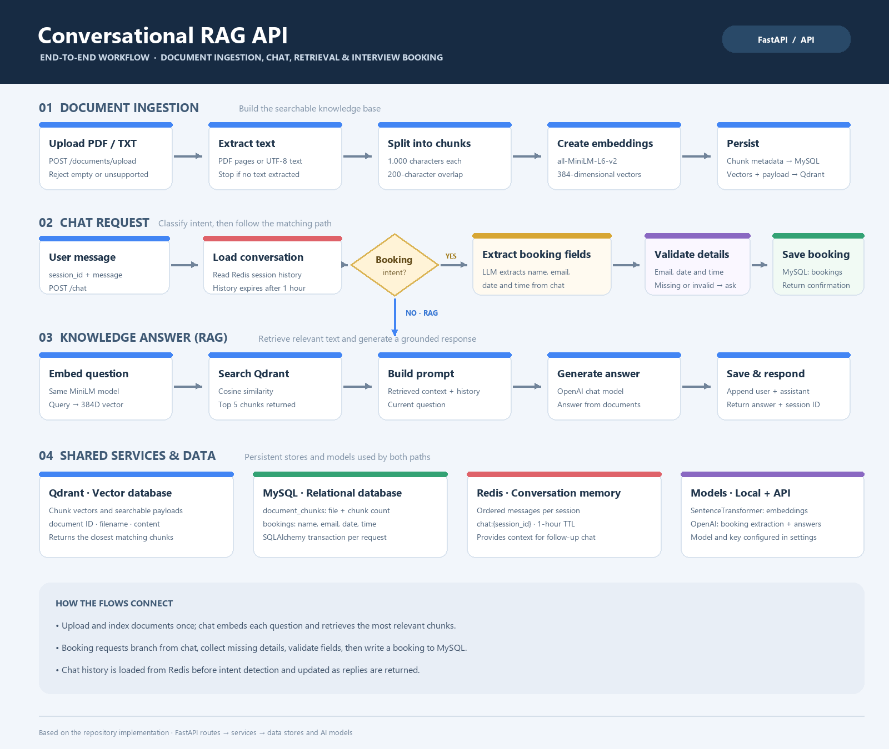

# custom-rag-Backend
# Conversational RAG API

A FastAPI service that answers questions using uploaded PDF/TXT documents and can also collect and save interview bookings through chat. Conversation history is stored in Redis; document metadata and bookings use MySQL; document vectors are stored in Qdrant.



## How it works

### Document ingestion

1. Upload a non-empty PDF or TXT file to `POST /documents/upload`.
2. Extract text from the PDF pages or read the TXT as UTF-8.
3. Split the text into 1,000-character chunks with a 200-character overlap.
4. Embed each chunk using `sentence-transformers/all-MiniLM-L6-v2` (384-dimensional vectors).
5. Save document metadata to MySQL and chunk vectors and payloads to Qdrant.

### Chat and retrieval

1. Send a session ID and message to `POST /chat`.
2. Load the session's conversation history from Redis.
3. Ask the configured OpenAI chat model to identify interview-booking intent and extract any supplied details.
4. For a normal question, embed it and search Qdrant for the five closest chunks. Send the retrieved context, chat history, and question to the OpenAI chat model, then save the user message and answer in Redis.
5. For an interview booking, ask for missing details, validate the name, email, date, and time, and save a complete booking to MySQL.

Redis history expires one hour after the most recent message. The RAG prompt instructs the assistant to answer from uploaded document context and say when information is not available there.

## Requirements

- Python 3.10 or later
- Docker with Docker Compose (for MySQL, Qdrant, and Redis)
- An OpenAI API key and access to the configured chat model

Install the Python packages used by the application:

```bash
pip install fastapi uvicorn sqlalchemy pymysql pydantic pydantic-settings python-multipart openai qdrant-client redis sentence-transformers pymupdf email-validator
```

## Configuration and startup

1. Create a `.env` file from `.env.example` and set `DATABASE_URL` and `OPENAI_API_KEY`. The database URL must match the MySQL user, password, database, and host you run. Set the OpenAI model with `OPENAI_CHAT_MODEL`; the example uses `gpt-4o-mini`.
2. Start the backing services:

   ```bash
   docker compose up -d
   ```

   The Compose file exposes MySQL on port `3306`, Qdrant on `6333`, and Redis on `6379`. Ensure MySQL is configured with credentials matching `DATABASE_URL` before starting it.

3. Install dependencies and start the API:

   ```bash
   pip install fastapi uvicorn sqlalchemy pymysql pydantic pydantic-settings python-multipart openai qdrant-client redis sentence-transformers pymupdf email-validator
   uvicorn main:app --reload
   ```

   The API is available at `http://localhost:8000`. Interactive API documentation is at `http://localhost:8000/docs`; the health endpoint is `GET /health`.

The first embedding request downloads `sentence-transformers/all-MiniLM-L6-v2` if it is not already cached. The embedding model is selected in `services/embeddings.py`; `OPENAI_EMBEDDING_MODEL` in `.env.example` is not currently read by the application.

## API examples

### Upload a document

```bash
curl -X POST http://localhost:8000/documents/upload \
  -F "file=@./handbook.pdf"
```

Only PDF and TXT files are accepted. A successful response includes the filename and number of chunks created.

### Ask a question

```bash
curl -X POST http://localhost:8000/chat \
  -H "Content-Type: application/json" \
  -d '{"session_id":"demo-session","message":"What is the vacation policy?"}'
```

Reuse the same `session_id` to keep the conversation context. The response contains the session ID and assistant answer.

### Book an interview through chat

Use the same `/chat` endpoint and ask to book an interview. Provide the candidate's name, email, date, and time in the conversation. The assistant asks for any missing information and confirms the booking after it is saved.

## Storage

- **MySQL**: `document_chunks` metadata and `bookings` records.
- **Qdrant**: document chunk vectors and payloads. Collection and URL are set by `QDRANT_COLLECTION` and `QDRANT_URL`.
- **Redis**: session message history. URL is set by `REDIS_URL`.

The SQLAlchemy tables are created at API startup. Qdrant creates the configured collection when its service initializes. Docker Compose persists service data in named volumes.

## Project layout

```text
routes/       FastAPI document and chat endpoints
services/     Ingestion, parsing, chunking, embeddings, RAG, memory, booking
schemas/      Request, response, and booking validation models
models/       SQLAlchemy document and booking tables
database/     SQLAlchemy engine and session dependency
core/         Environment-backed application settings
workflow.png  End-to-end workflow diagram
```
## Run the app:
python -m uvicorn main:app --reload
